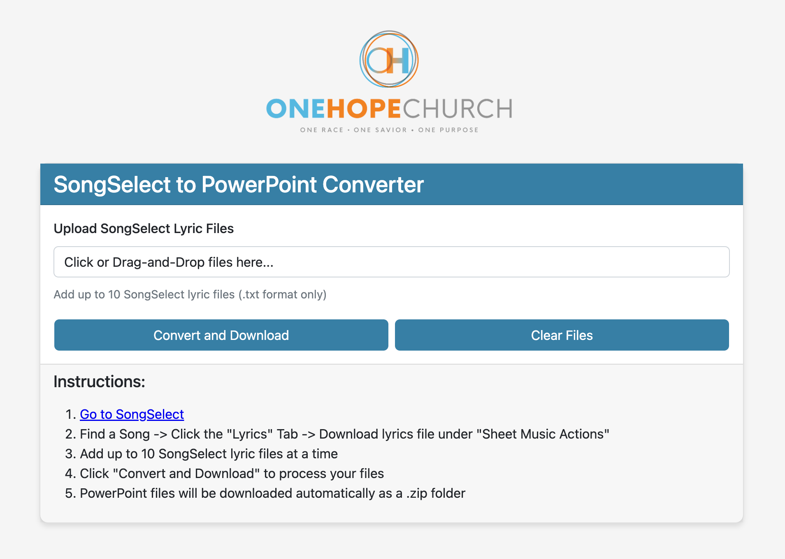
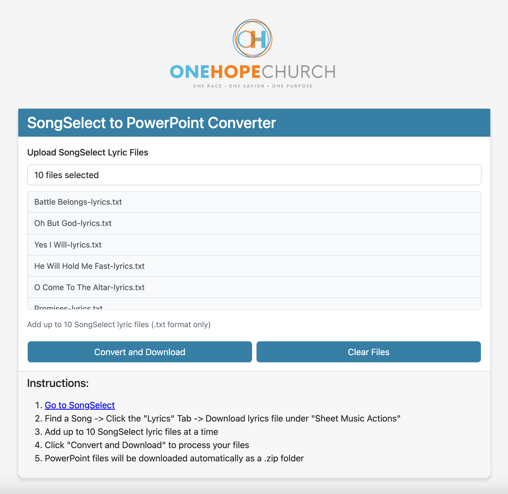
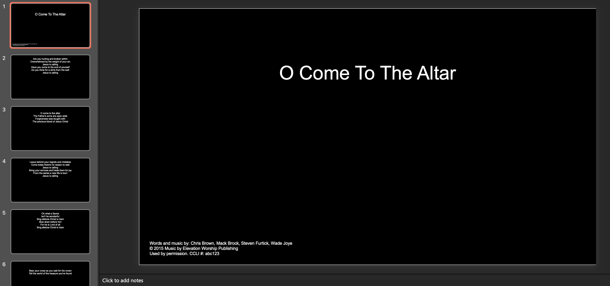
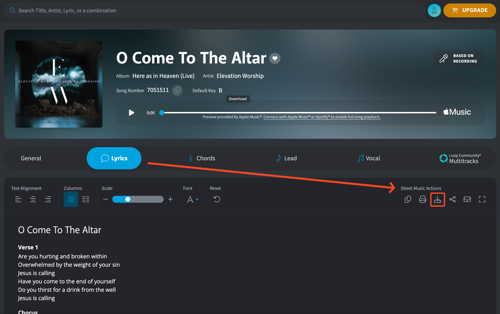

# SongSelect to PowerPoint Converter
A simple web app that converts SongSelect lyric .txt files into PowerPoint .pptx files. Packaged as a Docker container.

  

> [!CAUTION]
> While this app is a web app, it is designed to be run locally or behind a reverse proxy (preferrably with authentication) and not designed to be exposed to the public internet. Do so at your own risk.

# App Use
  * Add up to 10 SongSelect lyric .txt files at a time
  * Click "Convert and Download"
  * Downloaded as a .zip containing the .pptx files  

  

# PPT Slide Formatting
PPT slides are formatted as follows...
  * 16:9 format
  * Solid black background
  * Title slide with proper CCLI copyright formatting
  * Lyric slide follow the title slide with text centered in the top half of the slide  

  

# SongSelect TXT File Format
SongSelect provides lyrics as a standardized .txt file download. This app is designed to use the default lyric file formatting without any modifications. The txt file can be downloaded from the Lyrics tab as seen in the screenshot below.  

> [!NOTE]
> A SongSelect login is required to download lyrics.  

  

# Run the App
> [!IMPORTANT]
> The title slide includes formatted copyright info [as required by CCLI](https://ccli.com/us/en/5-questions) when displaying lyrics. In order to use your CCLI Copyright License number, set an environment variable for `CCLI_LIC_NUM` or else it will be displayed as "None".  

## Run Locally
(Requires Python 3.x)
    * Clone the repo
    * Install dependencies (requirements.txt)
    * Set an environment variable for your CCLI Copyright License number as follows
        * `CCLI_LIC_NUM=abc123`
    * Navigate into the `/app` directory
    * Start Flask with `python3 webapp.py`  

## Run As a Docker Container
An example Docker compose file is included in this repo.  
Start the container using compose with...
'''
docker compose up -d
'''  

Or run directly from Docker with...
```
docker pull ghcr.io/onehopeatl/songselect_lyric_converter:latest
docker run -e "CCLI_LIC_NUM=abc123" -p 8080:8080 --name lyric-converter
```  